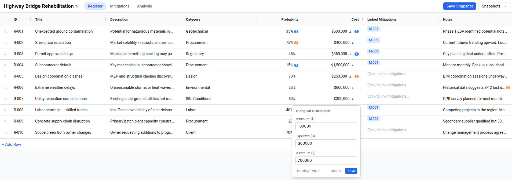
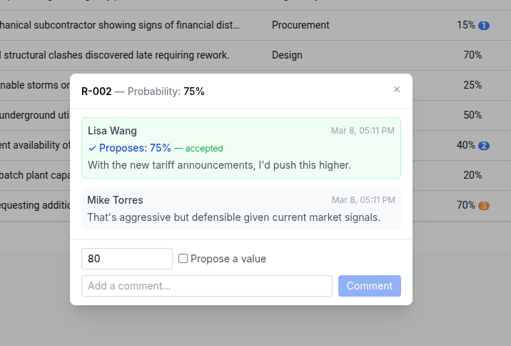
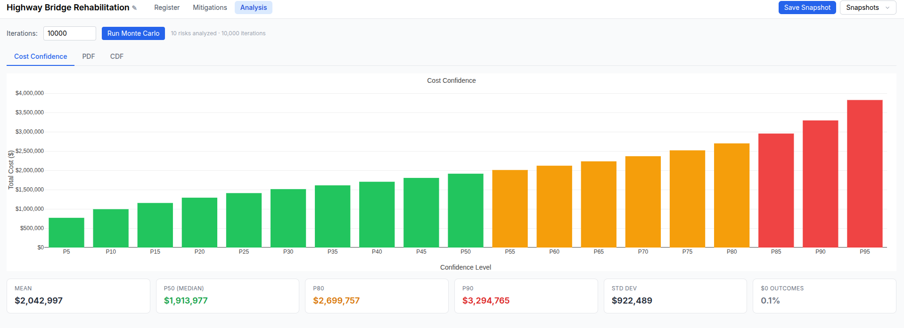

# DARPI — Don't Accept Risk, Price It

A collaborative risk register platform for large construction and infrastructure projects. DARPI replaces the spreadsheet-based workflows that project teams use to identify, score, and mitigate risks while keeping the familiar, Excel-like interface that practitioners expect.

A primary goal of the project was to see how I could use Claude Code to develop a prototype.
The file [initial_prompt](initial_prompt.md) has the contents of my intiaal idea for the product.
I iterated on this with Claude Code to develop the [PRODUCT_VISION.md](PRODUCT_VISION.md) [PROTOTYPE_SPEC.md](PROTOTYPE_SPEC.md) files, which were the primary resources for the build process.

**Status: working prototype.**

The core register, Monte Carlo analysis, comment/proposal workflow, and snapshot versioning are built and functional. See [What's Built](#whats-built) for scope.

---

## The Problem

On large infrastructure projects, risk quantification workshops are a standard practice. A facilitator leads a room of engineers, estimators, attorneys, and project managers through a structured process: identify risks, assign probabilities, estimate cost impacts, and produce a contingency figure. The output is a risk register that typically lives in a spreadsheet.

Spreadsheets create real problems for this workflow:

- **Collaboration is clunky.** Multiple stakeholders editing the same file, emailing versions back and forth, no structured way to propose or debate a specific value.
- **History is lost.** When the team revisits the register after a design milestone, it's hard to see what changed, why, and what the risk profile looked like before.
- **Analysis is manual.** Monte Carlo simulations require separate tools; updating the register means re-running everything.
- **The workshop pace suffers.** Facilitators spend time managing the file instead of driving the conversation.

Purpose-built tools exist (Primavera Risk Analysis, @Risk) but they're heavy, expensive, and designed for analysts — not for the live collaborative dynamic of a workshop.

---

## What DARPI Is

DARPI is a lightweight web application that gives the facilitator a fast, keyboard-navigable risk register (think Airtable) backed by a proper database. It's designed to be used live on a 13" laptop screen over Zoom/Teams.

The core workflow:

1. **Build the register** — add risks inline, tab between cells, assign probabilities and cost impacts.
2. **Negotiate values** — stakeholders leave cell-level comments or formal value proposals; the facilitator accepts or rejects them.
3. **Run the analysis** — Monte Carlo simulation produces a cost PDF/CDF with P10–P90 summary statistics in real time.
4. **Snapshot and iterate** — save named snapshots at key decision points (end of workshop, after design review) to track how the risk profile evolves.



---

## What's Built

This prototype covers the quantitative risk workflow end to end:

- Inline-editable risk register (AG Grid)
- Triangular cost distributions (min/expected/max popover)
- Cell-level comments and value proposals with accept/reject

- Mitigation table with many-to-many risk linking
- Monte Carlo PDF/CDF with P10/P50/P80/P90 statistics

- Named snapshots (save and load register state)
- Demo datasets (10-risk walkthrough, 200-risk transit mega-project)

**Not yet built:**

- qualitative mode (1–5 bins)
- heat map
- custom columns
- snapshot comparison
- mitigation reduction math
- multi-user real-time editing
- authentication
- program/hierarchy roll-ups
- schedule risk analysis
- export

See [PROTOTYPE_SPEC.md](PROTOTYPE_SPEC.md) for the full scope rationale, and [PRODUCT_VISION.md](PRODUCT_VISION.md) for where the product is headed.

---

## Running the Prototype

**Prerequisites:** Python 3.12+, Node.js, [`uv`](https://docs.astral.sh/uv/getting-started/installation/)

```bash
git clone https://github.com/konnerhorton/darpi.git
cd darpi
./start.sh
```

`start.sh` handles everything: Python virtual environment, backend dependencies, frontend build, and database setup. On first run it will ask whether to start empty or load one of two demo datasets.

The app runs at **http://localhost:8000**.

> The demo datasets are a good starting point. The 10-risk "workflow walkthrough" is useful for exploring the comment/proposal flow. The 200-risk "transit mega-project" is useful for stress-testing the Monte Carlo performance.

---

## Architecture

| Layer | Technology | Notes |
|---|---|---|
| Backend | Python 3.12 / FastAPI | Async REST API at `/api/v1` |
| Database | SQLite via SQLAlchemy 2.0 | Single-file, portable — the register file is the database |
| Migrations | Alembic | Schema evolution from day one |
| Monte Carlo | NumPy (vectorized) | 200 risks × 10k iterations in ~50ms |
| Frontend | React 18 + TypeScript + Vite | |
| Table | AG Grid Community | Inline editing, keyboard nav, custom cell renderers |
| Charts | Plotly.js | Interactive PDF/CDF |
| Styling | Tailwind CSS | |

The frontend is fully decoupled from the backend via REST — no server-side rendering. The SQLite file is the complete state of a register; it can be copied, backed up, or handed off as a standalone artifact.

---

## Product Documents

The product thinking is documented in two files:

- **[PRODUCT_VISION.md](PRODUCT_VISION.md)** — Full product vision: qualitative/quantitative modes, program hierarchy, schedule risk analysis, value negotiation workflow, and the long-term parametric risk intelligence concept.
- **[PROTOTYPE_SPEC.md](PROTOTYPE_SPEC.md)** — Detailed prototype specification: data model, API design, component breakdown, and explicit scope decisions. This is the build plan for what's currently implemented.
