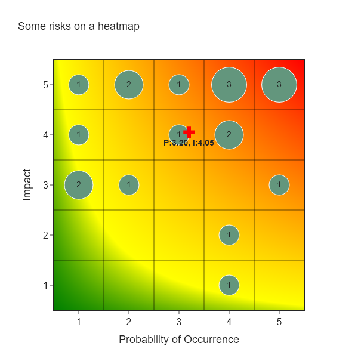

# Heat Maps

Plot heatmaps to show the geometric mean of the risk scores.

## Import libraries

```python
from darpi.qualitative.plots import plot_empty_heat_map, add_scatter_to_heat_map
```

## Generate Random Risks

### Generate Risks

```python
import random
import pandas as pd


def generate_risks(num_risks=20):
    risks = []
    for i in range(num_risks):
        risk = {
            "risk-id": f"R-{int(i + 1):03}",
            "probability": random.randint(1, 5),
            "schedule": random.randint(1, 5),
            "cost": random.randint(1, 5),
        }
        risks.append(risk)
    return risks

risks = generate_risks()
```

### Calculate Risk Scores

```python
df = pd.DataFrame(risks)
df["impact"] = df[["schedule", "cost"]].max(axis=1)
df["risk-score"] = df["probability"]
df
```

| risk-id   |   probability |   schedule |   cost |   impact |   risk-score |
|:----------|--------------:|-----------:|-------:|---------:|-------------:|
| R-001     |             4 |          5 |      1 |        5 |           20 |
| R-002     |             2 |          4 |      3 |        4 |            8 |
| R-003     |             1 |          2 |      2 |        2 |            2 |
| R-004     |             2 |          1 |      1 |        1 |            2 |
| R-005     |             1 |          4 |      1 |        4 |            4 |
| R-006     |             3 |          1 |      3 |        3 |            9 |
| R-007     |             1 |          3 |      5 |        5 |            5 |
| R-008     |             5 |          4 |      5 |        5 |           25 |
| R-009     |             3 |          3 |      4 |        4 |           12 |
| R-010     |             5 |          3 |      5 |        5 |           25 |
| R-011     |             3 |          2 |      4 |        4 |           12 |
| R-012     |             4 |          5 |      1 |        5 |           20 |
| R-013     |             2 |          2 |      4 |        4 |            8 |
| R-014     |             2 |          3 |      2 |        3 |            6 |
| R-015     |             1 |          2 |      3 |        3 |            3 |
| R-016     |             1 |          4 |      2 |        4 |            4 |
| R-017     |             4 |          4 |      2 |        4 |           16 |
| R-018     |             4 |          2 |      2 |        2 |            8 |
| R-019     |             1 |          3 |      3 |        3 |            3 |
| R-020     |             3 |          5 |      4 |        5 |           15 |

### Find the Count for Each impact-probability Combination

```python
df = (
    df[["risk-id", "probability", "impact"]]
    .groupby(["probability", "impact"])
    .agg("count")
    .reset_index()
    .rename(columns={"risk-id": "counts"})
)
df
```

|   probability |   impact |   counts |
|--------------:|---------:|---------:|
|             1 |        2 |        1 |
|             1 |        3 |        2 |
|             1 |        4 |        2 |
|             1 |        5 |        1 |
|             2 |        1 |        1 |
|             2 |        3 |        1 |
|             2 |        4 |        2 |
|             3 |        3 |        1 |
|             3 |        4 |        2 |
|             3 |        5 |        1 |
|             4 |        2 |        1 |
|             4 |        4 |        1 |
|             4 |        5 |        2 |
|             5 |        5 |        2 |

### Send to Records for Plotting

```python
risks = df.to_dict("records")
risks

[{'probability': 1, 'impact': 2, 'counts': 1},
 {'probability': 1, 'impact': 3, 'counts': 2},
 {'probability': 1, 'impact': 4, 'counts': 2},
 {'probability': 1, 'impact': 5, 'counts': 1},
 {'probability': 2, 'impact': 1, 'counts': 1},
 {'probability': 2, 'impact': 3, 'counts': 1},
 {'probability': 2, 'impact': 4, 'counts': 2},
 {'probability': 3, 'impact': 3, 'counts': 1},
 {'probability': 3, 'impact': 4, 'counts': 2},
 {'probability': 3, 'impact': 5, 'counts': 1},
 {'probability': 4, 'impact': 2, 'counts': 1},
 {'probability': 4, 'impact': 4, 'counts': 1},
 {'probability': 4, 'impact': 5, 'counts': 2},
 {'probability': 5, 'impact': 5, 'counts': 2}]
```

### Plot the Heatmap

```python
fig = add_scatter_to_heat_map(risks, "Some risks on a heatmap")
fig.write_image("heat-map.png")
fig.show()
```


