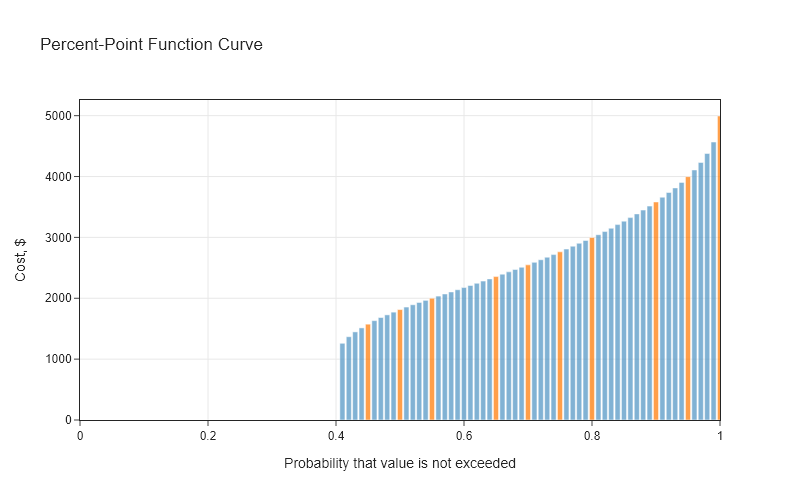

# Single Risk

Determine non-exceedence probabilities for a single risk.

## Import libraries

```python
import sys
import os

import pandas as pd

from darpi.quantitative.plots import plot_histogram_and_cdf, plot_ppf_curve
from darpi.quantitative.probability import (
    get_histogram_data,
    get_samples,
    get_triangular_distribution,
    get_empirical_cdf,
    get_empirical_ppf,
    sum_samples,
)
from darpi.qualitative.plots import plot_empty_heat_map, add_scatter_to_heat_map
```

## Generate probability of non-exceedance charts for one risk

```python
# Identify the risk, cost, and probability of occurrence
risk = "Risk 1"
costs = (1000, 2000, 5000)
probability = 0.6

# Generate the triangular distribution that corresponds with the risk above
distribution = get_triangular_distribution(a=costs[0], b=costs[2], c=costs[1])

# Generate the samples (the default is n==100,000)
data = get_samples(distribution=distribution, risk_probability=probability)

# Get plotting data
hist_data = get_histogram_data(data)
cdf_data = get_empirical_cdf(data)
ppf_data = get_empirical_ppf(data)

# Make some plots
fig = plot_histogram_and_cdf(hist_data=hist_data, cdf_data=cdf_data)
# fig.write_image("images/single-risk-histogram_cdf.png")
fig = plot_ppf_curve(data=ppf_data)
# fig.write_image("images/single-risk-ppf.png")
```




## Generate probability of non-exceedance table for one risk

```python
get_non_exceedance_table(data).round(2)
```

<div>
<style scoped>
    .dataframe tbody tr th:only-of-type {
        vertical-align: middle;
    }

    .dataframe tbody tr th {
        vertical-align: top;
    }

    .dataframe thead th {
        text-align: right;
    }
</style>
<table border="1" class="dataframe">
  <thead>
    <tr style="text-align: right;">
      <th></th>
      <th>cost</th>
      <th>p</th>
    </tr>
  </thead>
  <tbody>
    <tr>
      <th>0</th>
      <td>0.00</td>
      <td>0.00</td>
    </tr>
    <tr>
      <th>1</th>
      <td>0.00</td>
      <td>0.01</td>
    </tr>
    <tr>
      <th>2</th>
      <td>0.00</td>
      <td>0.02</td>
    </tr>
    <tr>
      <th>3</th>
      <td>0.00</td>
      <td>0.03</td>
    </tr>
    <tr>
      <th>4</th>
      <td>0.00</td>
      <td>0.04</td>
    </tr>
    <tr>
      <th>...</th>
      <td>...</td>
      <td>...</td>
    </tr>
    <tr>
      <th>96</th>
      <td>4099.60</td>
      <td>0.96</td>
    </tr>
    <tr>
      <th>97</th>
      <td>4224.11</td>
      <td>0.97</td>
    </tr>
    <tr>
      <th>98</th>
      <td>4365.02</td>
      <td>0.98</td>
    </tr>
    <tr>
      <th>99</th>
      <td>4554.38</td>
      <td>0.99</td>
    </tr>
    <tr>
      <th>100</th>
      <td>4987.99</td>
      <td>1.00</td>
    </tr>
  </tbody>
</table>
<p>101 rows × 2 columns</p>
</div>
