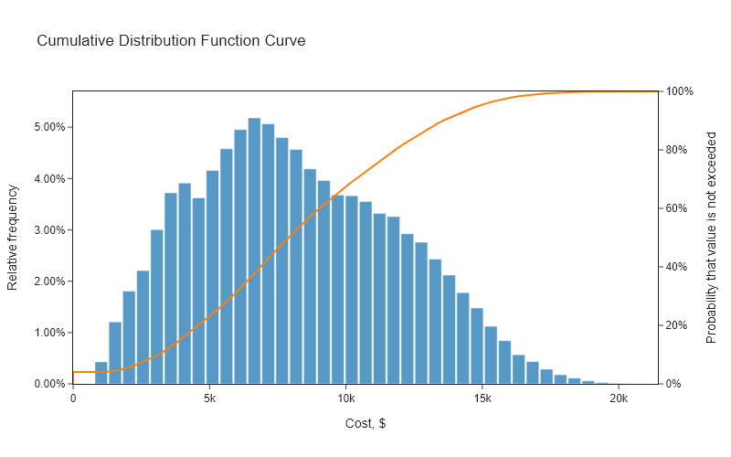
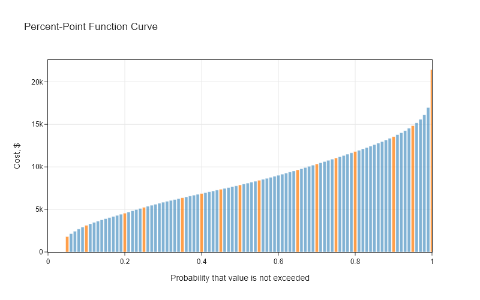

# Single Risk

Determine non-exceedence probabilities for a multiple risks.

## Import libraries


```python
import sys
import os

import pandas as pd

# Add the root_dir to the path so `darpi` can be imported
root_dir = os.path.abspath(os.path.join(os.getcwd(), ".."))

if root_dir not in sys.path:
    sys.path.append(root_dir)
from darpi.plots import plot_histogram_and_cdf, plot_ppf_curve


from darpi.probability import (
    get_histogram_data,
    get_samples,
    get_triangular_distribution,
    get_empirical_cdf,
    get_empirical_ppf,
    sum_samples,
)
from darpi.tables import get_non_exceedance_table
```

## Generate probability of non-exceedance charts for multiple risks


```python
# Identify some risks
risks = {
    "Risk 1": {"costs": (1000, 2000, 5000), "probability": 0.6},
    "Risk 2": {"costs": (2000, 4000, 8000), "probability": 0.8},
    "Risk 3": {"costs": (2800, 4000, 10000), "probability": 0.5},
}

# Get samples for each risk
for risk, details in risks.items():
    a, c, b = details["costs"]
    risk_probability = details["probability"]
    distribution = get_triangular_distribution(a, b, c)
    data = get_samples(distribution=distribution, risk_probability=risk_probability)
    risks[risk]["samples"] = data

# Get summed data
data = sum_samples([risk["samples"] for risk in risks.values()])

# Get plotting data
hist_data = get_histogram_data(data)
cdf_data = get_empirical_cdf(data)
ppf_data = get_empirical_ppf(data)

# Make some plots
fig = plot_histogram_and_cdf(hist_data=hist_data, cdf_data=cdf_data)
fig.write_image("images/multiple-risk-histogram_cdf.png")
fig = plot_ppf_curve(data=ppf_data)
fig.write_image("images/multiple-risk-ppf.png")
```




## Generate probability of non-exceedance table for multiple risks


```python
get_non_exceedance_table(data).round(2)
```


<div>
<style scoped>
    .dataframe tbody tr th:only-of-type {
        vertical-align: middle;
    }

    .dataframe tbody tr th {
        vertical-align: top;
    }

    .dataframe thead th {
        text-align: right;
    }
</style>
<table border="1" class="dataframe">
  <thead>
    <tr style="text-align: right;">
      <th></th>
      <th>cost</th>
      <th>p</th>
    </tr>
  </thead>
  <tbody>
    <tr>
      <th>0</th>
      <td>0.00</td>
      <td>0.00</td>
    </tr>
    <tr>
      <th>1</th>
      <td>0.00</td>
      <td>0.01</td>
    </tr>
    <tr>
      <th>2</th>
      <td>0.00</td>
      <td>0.02</td>
    </tr>
    <tr>
      <th>3</th>
      <td>0.00</td>
      <td>0.03</td>
    </tr>
    <tr>
      <th>4</th>
      <td>0.00</td>
      <td>0.04</td>
    </tr>
    <tr>
      <th>...</th>
      <td>...</td>
      <td>...</td>
    </tr>
    <tr>
      <th>96</th>
      <td>15155.18</td>
      <td>0.96</td>
    </tr>
    <tr>
      <th>97</th>
      <td>15579.32</td>
      <td>0.97</td>
    </tr>
    <tr>
      <th>98</th>
      <td>16108.59</td>
      <td>0.98</td>
    </tr>
    <tr>
      <th>99</th>
      <td>16887.59</td>
      <td>0.99</td>
    </tr>
    <tr>
      <th>100</th>
      <td>21930.77</td>
      <td>1.00</td>
    </tr>
  </tbody>
</table>
<p>101 rows × 2 columns</p>
</div>


